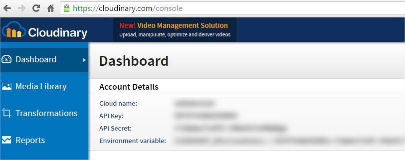

# Cloudinary

This project contains Cloudinary Interface Asset for IntuiFace Player & IntuiFace Composer.

The purpose of this .NET Interface Asset is to enable an IntuiFace experience to upload an image during runtime to a cloud service. The image URL can then be used either combined with a [QR Code Encoder](http://support.intuilab.com/kb/interface-assets/interface-asset-qr-code) or sent in an email body with the [Share via Email](http://support.intuilab.com/kb/interface-assets/share-assets-via-email) Interface Assets. 

# Prerequisite: Cloudinary account

[Cloudinary](http://cloudinary.com/) has a free version which will let you host a certain amount of images. To use our Interface Asset, you **must create your own account** on their website. You will then be able to copy & paste the following from their dashboard to your Interface Asset in Composer: 

* Cloud name
* API key
* API secret

In Composer: 

# How to build this project?

**PREREQUISITES**: you must have Visual Studio 2010 and .NET 4 installed.

The code language for Phidgets Interface Assets is C#.

To build this project, follow these steps:

* Open **ImageUploader.sln** in Visual Studio 2010 or above,
* Build the solution in **Release** mode,
* Navigate to the **bin/release** folder of the project, these are all the files to gather in a **CloudinaryImageUploader** folder before using them in Composer (see below). 

# How to use Cloudinary Image Uploader Interface Assets in Composer?

To be able to add Cloudinary Image Uploader Interface Assets in IntuiFace Composer, follow these steps: 

* Copy the **CloudinaryImageUploader** folder from the **OutputAssemblies** to the path "[Drive]:\Users\\[UserName]\Documents\IntuiFace\Interface Assets",
* Launch **IntuiFace Composer**,
* Add an Interface Asset and when you enter "Cloudinary" in the search bar, you can see the **Cloudinary Image Uploader** Interface Asset.

See more information on our [support webpage](http://support.intuilab.com/kb/interface-assets/upload-an-image-to-cloudinary)

-----

Copyright &copy; 2016 IntuiLab.

Released under the **MIT License**.
